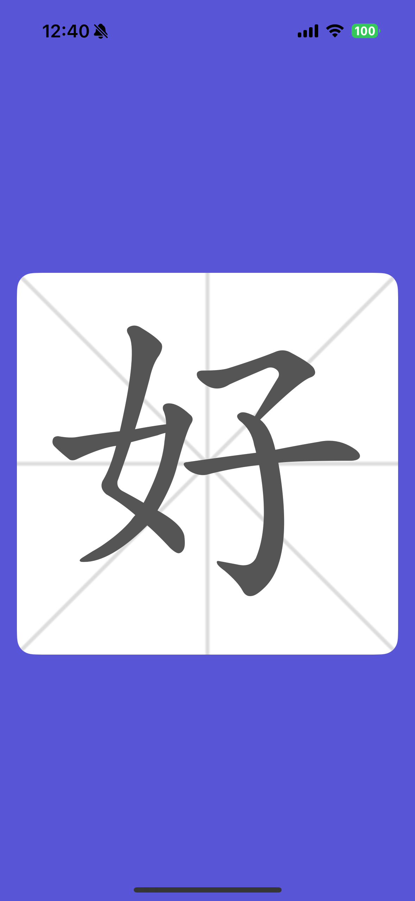

# HanziWriter for Swift


**HanziWriter for Swift** is a Swift wrapper around [HanziWriter](https://hanziwriter.org/), which is a JavaScript library for Chinese character stroke order animations and stroke order practice quizzes. This wrapper provides a simple and easy-to-use Swift API which tries to mimic the original library's API as closely as possible.

## Install

### Swift Package Manager

To install HanziWriter for Swift using Swift Package Manager, add the following line to your `Package.swift` file:

```swift
.package(url: "https://github.com/pepebecker/hanziwriter-swift.git", from: "0.1.0")
```

## Usage Examples

### Basic Character Animation Example

#### SwfitUI



```swift
import SwiftUI
import HanziWriter

struct ContentView: View {
  var options = HWOptions(autoResize: true)
  var body: some View {
    ZStack {
      Image("grid").resizable()
      HWView(options: options, character: "好") { writer in
        writer.animateCharacter()
      }
    }
    .aspectRatio(1, contentMode: .fit)
    .background(Color.white)
    .cornerRadius(16)
    .padding()
    .frame(maxWidth: .infinity, maxHeight: .infinity)
    .background(Color.indigo)
  }
}

#Preview {
  ContentView()
}
```

#### UIKit

```swift
import UIKit
import HanziWriter

class ViewController: UIViewController {
  override func viewDidLoad() {
    super.viewDidLoad()

    var options = HWOptions(autoResize: true)

    var writer = HanziWriter(options: options) { writer in
      writer.setCharacter("好")
      writer.animateCharacter()
    }

    self.view.addSubview(writer.view)
    // set the view's frame origin and size or autolayout constraints as needed
  }
}
```

### Basic Character Quiz Example

#### SwiftUI

```swift
import SwiftUI
import HanziWriter

struct ContentView: View {
  var options = HWOptions(autoResize: true)
  var body: some View {
    ZStack {
      Image("grid").resizable()
      HWView(options: options, character: "好") { writer in
        // first let the user know the stroke order
        writer.animateCharacter() {
          // then quiz the user for the correct stroke order
          writer.quiz { result in
            guard let result = try? result.get() else { return }
            print("Quiz Completed. Mistakes: \(result.totalMistakes)")
          } onCorrectStroke: { result in
            guard let result = try? result.get() else { return }
            print("Correct Stroke: \(result.strokeNum)")
          } onMistake: { result in
            guard let result = try? result.get() else { return }
            print("Wrong Stroke: \(result.strokeNum)")
          }
        }
      }
    }
    .aspectRatio(1, contentMode: .fit)
    .background(Color.white)
    .cornerRadius(16)
    .padding()
    .frame(maxWidth: .infinity, maxHeight: .infinity)
    .background(Color.indigo)
  }
}

#Preview {
  ContentView()
}
```

#### UIKit

```swift
import UIKit
import HanziWriter

class ViewController: UIViewController {
  override func viewDidLoad() {
    super.viewDidLoad()

    var options = HWOptions(autoResize: true)

    var writer = HanziWriter(options: options) { writer in
      writer.setCharacter("好")
      writer.animateCharacter() {
        writer.quiz { result in
          guard let result = try? result.get() else { return }
          print("Quiz Completed. Mistakes: \(result.totalMistakes)")
        } onCorrectStroke: { result in
          guard let result = try? result.get() else { return }
          print("Correct Stroke: \(result.strokeNum)")
        } onMistake: { result in
          guard let result = try? result.get() else { return }
          print("Wrong Stroke: \(result.strokeNum)")
        }
      }
    }

    self.view.addSubview(writer.view)
    // set the view's frame origin and size or autolayout constraints as needed
  }
}
```

## Related

- [`HanziWriter`](https://github.com/chanind/hanzi-writer) - The original HanziWriter library for JavaScript.

## Contributing

If you **have a question**, **found a bug** or want to **propose a feature**, have a look at [the issues page](https://github.com/pepebecker/hanziwriter-swift/issues).
